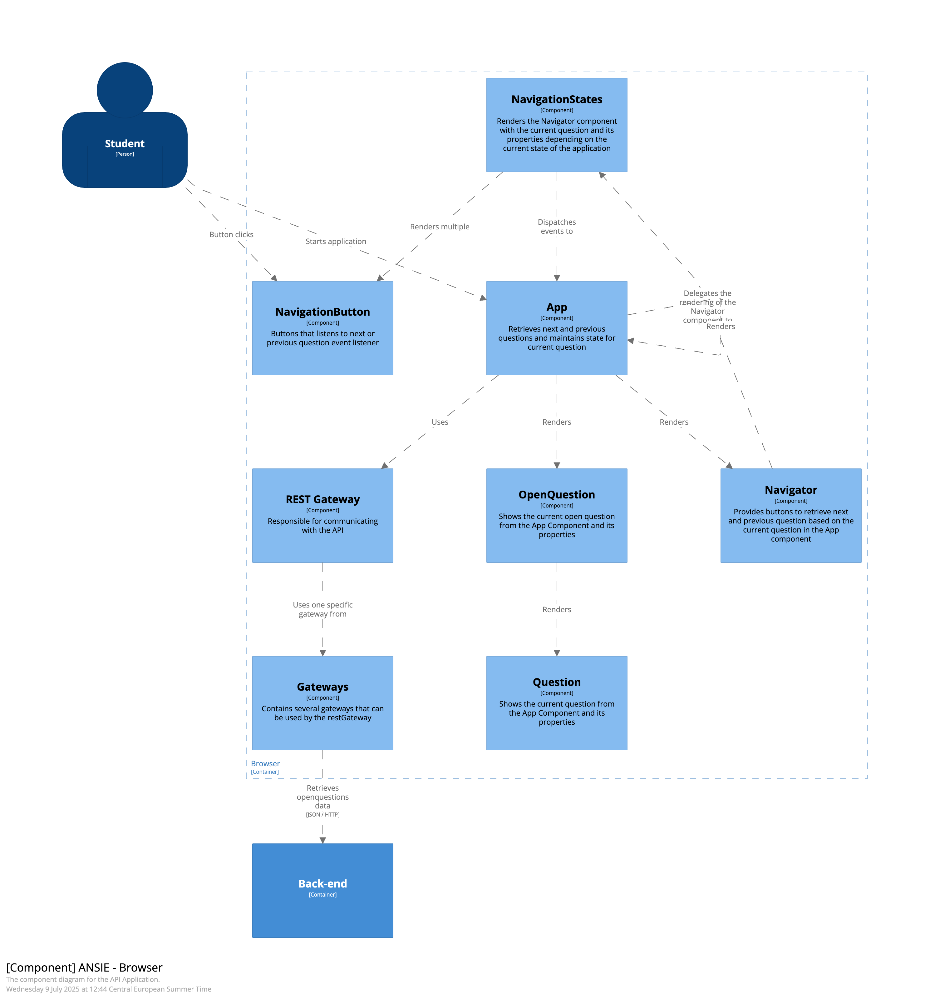

# Weekopdracht 1 voor de cursus TEEX

## Introduction

De applicatie "ANSIE" betreft een prototype van een toetsapplicatie. Op dit moment is de applicatie alleen geschikt om door een aantal toetsvragen heen te navigeren die beschikbaar zijn in de back-end. In deze week hoef je nog geen broncode te veranderen maar vooral op zoek gaan naar design patterns, principes en properties.

## Context

Je kunt behalve door de toetsvragen heen navigeren ook je antwoord invoeren. Dat antwoord wordt niet opgeslagen of onthouden maar dat is voor deze opdracht niet relevant.

## Functional Overview

In deze applicatie staan toetsvragen centraal. De back-end ondersteunt verschillende vraag-types maar de front-end alleen open vragen.

## Quality Attributes

Modularity
Reusability

## Principles

Deze applicatie bouwt voort op de onderstaande principes uit semester 1:

Back-end

- Package by layer
- Embedded Application Server
- Dependency Injection
- JDBC Templates

Front-end

- Prop-drilling
- Function passing
- Conditional Rendering

## Software Architecture

### Container Diagram

### Component Diagram

## Deployment

### Software

React
Java 17
Spring Boot
MySQL

### Building

Back-end
`mvn package`

Front-end
`npm run build`

### Configuration

Back-end: Het .env bestand bevat poorten en gebruikersnaam/wachtwoord voor toegang tot de database. Deze worden automatisch gebruikt door docker compose. Sommigen variabelen zijn gedupliceerd in een .env bestand in de backend/src/main/resources/.env voor als je zonder docker compose gaat ontwikkelen.

Front-end: Geen configuratie.

## Operation and Support

Bouw (compileer etc.) de hele stack met Docker Compose:

`docker-compose build`

Run de hele stack met Docker Compose:

`docker-compose up`

De verschillende componenten gebruiken elk een eigen netwerk port.

| **component** | **port** |
| ------------- | -------- |
| db            | 3306     |
| backend       | 8080     |
| frontend      | 5173     |

### Back-end

Run de back-end met Maven:

`mvn spring-boot:run`

Of met Docker Compose:
`docker compose up backend db`

### Front-end

Run de front-end:

`npm run start`

Of met Docker Compose:
`docker compose up frontend`
